<h1 align="center">Desenvolvimento de uma Progressive Web App para identificação de condições foliares do cafeeiro utilizando inteligência artificial</h1>

## Resumo

A cafeicultura apresenta grande importância econômica e social, sendo o monitoramento fitossanitário das plantas uma atividade fundamental para a manutenção da produtividade e da qualidade da produção. A identificação de doenças e pragas em folhas de café é frequentemente realizada por inspeção visual, procedimento que pode demandar tempo, conhecimento especializado e deslocamento até as áreas de cultivo. Nesse contexto, técnicas de visão computacional e aprendizado de máquina podem contribuir para a criação de ferramentas capazes de auxiliar na identificação automática de alterações nas folhas do cafeeiro.

Este trabalho propõe o desenvolvimento de uma solução baseada em inteligência artificial para classificação de imagens de folhas de **Coffea arabica**, utilizando conjuntos de imagens previamente classificados para treinamento do modelo. Como base de dados, será utilizado o conjunto JMuBEN/JMuBEN2, composto por 58.555 imagens distribuídas entre cinco classes: folhas saudáveis (Healthy), minador (Miner), ferrugem (Rust), Phoma e Cercospora. As imagens foram obtidas em condições reais de cultivo no Quênia, com apoio de um patologista na identificação das condições foliares.

O treinamento será utilizado para obtenção dos pesos do modelo de classificação, que posteriormente serão empregados em uma aplicação Progressive Web App (PWA). A aplicação será projetada para funcionar tanto em navegadores de computadores quanto em dispositivos móveis, permitindo o acesso à câmera do aparelho para aquisição de novas imagens. A imagem capturada será submetida ao modelo treinado, possibilitando a comparação de suas características visuais com os padrões aprendidos durante o treinamento.

Como resultado esperado, pretende-se desenvolver um protótipo acessível e de baixo custo capaz de auxiliar na triagem de folhas de café, indicando a condição mais provável da amostra analisada.

**Palavras-chave:** inteligência artificial; visão computacional; café arábica; doenças foliares; aprendizado de máquina; Progressive Web App.

---

## 1. Introdução

A produção de café está diretamente relacionada às condições fitossanitárias das plantas. Doenças e pragas que afetam as folhas podem comprometer o desenvolvimento das plantas e, consequentemente, interferir na produção. A identificação dessas alterações é tradicionalmente realizada por observação visual, sendo necessário conhecimento específico para diferenciar sintomas semelhantes.

O avanço das técnicas de inteligência artificial, especialmente na área de visão computacional, possibilitou o desenvolvimento de sistemas capazes de analisar imagens e identificar padrões associados a diferentes condições de plantas. Nesse contexto, conjuntos de dados contendo imagens previamente classificadas são fundamentais para o treinamento de modelos de aprendizado de máquina.

Um conjunto particularmente relevante para esse propósito é o JMuBEN/JMuBEN2, apresentado por Jepkoech et al. (2021). Os autores desenvolveram conjuntos de imagens de folhas de café arábica coletadas na plantação de Mutira, no condado de Kirinyaga, Quênia. A aquisição foi realizada em condições reais utilizando câmera digital e contou com o auxílio de um patologista para identificação das condições das folhas.

O conjunto reúne cinco classes: **Healthy**, correspondente às folhas saudáveis; **Miner**, relacionada ao ataque do minador; **Rust**, correspondente à ferrugem; **Phoma**; e **Cercospora**. Segundo os autores, o conjunto totaliza 58.555 imagens, sendo 18.985 de folhas saudáveis, 16.979 de folhas afetadas por minador, 8.337 relacionadas à ferrugem, 6.572 relacionadas à Phoma e 7.682 relacionadas à Cercospora.

A existência de imagens já classificadas torna esse conjunto particularmente adequado para uma proposta de classificação automática. Diferentemente do conjunto BRACOT utilizado inicialmente na análise deste projeto, cujo objetivo principal é a segmentação de folhas e cujas anotações disponibilizadas identificam regiões como \`leaf\`, o JMuBEN/JMuBEN2 apresenta as imagens associadas às condições foliares. O BRACOT possui 300 imagens e 1.662 instâncias anotadas e foi desenvolvido especificamente para segmentação de folhas de cafeeiro.

Dessa maneira, este trabalho propõe utilizar o conjunto JMuBEN/JMuBEN2 como base para treinamento de um modelo de inteligência artificial destinado à classificação de imagens de folhas de café. Posteriormente, os pesos obtidos no treinamento serão integrados a uma aplicação do tipo **\*\*Progressive Web App (PWA)\*\***, permitindo que o usuário utilize um navegador de computador ou smartphone para realizar a captura de uma imagem por meio da câmera do dispositivo.

A proposta busca aproximar a utilização de modelos de inteligência artificial do ambiente agrícola, oferecendo uma interface simples na qual o usuário possa fotografar uma folha e receber uma classificação baseada no modelo treinado.

Obs: Para a cooxupé -> disponibilize amostras de café da região seja grãos, foliares ou plantação em imagem. As amostras precisam serem validadas por um especialista antes do treinamento. Então, vocês verão mais aplicativos ou soluções tecnológicas voltadas para a região de Passos/Alpinopolis.

---

## 2. Materiais e métodos

### 2.1 Base de dados

Para o desenvolvimento do modelo será utilizado o conjunto de imagens JMuBEN/JMuBEN2, disponibilizado publicamente pelos pesquisadores responsáveis pelo dataset. O artigo que apresenta a base informa que as imagens foram obtidas em uma plantação de café arábica localizada em Mutira, no condado de Kirinyaga, Quênia, sob condições reais de campo. A aquisição contou com câmera Fujifilm X-T4 e participação de um patologista, que auxiliou na identificação das condições das folhas.

As imagens são distribuídas entre cinco classes:

- **Healthy** → Saudável
- **Miner** → Minador
- **Rust** → Ferrugem
- **Phoma** → Phoma
- **Cercospora** → Cercosporiose

Os autores destacam que as imagens foram anotadas e estão preparadas para utilização em aplicações de aprendizado de máquina relacionadas à identificação e classificação de doenças em folhas de café.

### 2.2 Amostragem das classes

Para ilustrar as classes utilizadas na amostragem do conjunto de dados, são apresentadas quatro imagens representativas de cada categoria. A organização das imagens segue a estrutura de diretórios utilizada no projeto, mantendo o padrão de nomenclatura `Classe_0001`, `Classe_0002` e assim por diante.

**Healthy — Folha saudável**

| Healthy_0001 | Healthy_0002 | Healthy_0003 | Healthy_0004 |
|:---:|:---:|:---:|:---:|
|  |  |  |  |

**Miner — Minador**

| Miner_0001 | Miner_0002 | Miner_0003 | Miner_0004 |
|:---:|:---:|:---:|:---:|
| 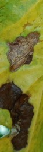 | 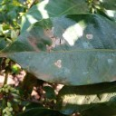 | 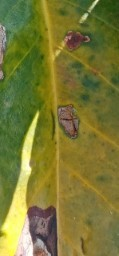 | 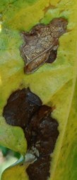 |

**Cercospora — Cercosporiose**

| Cercospora_0001 | Cercospora_0002 | Cercospora_0003 | Cercospora_0004 |
|:---:|:---:|:---:|:---:|
| 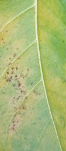 | 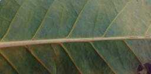 |  |  |

**Phoma — Phoma**

| Phoma_0001 | Phoma_0002 | Phoma_0003 | Phoma_0004 |
|:---:|:---:|:---:|:---:|
| 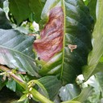 | 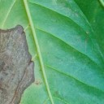 |  |  |

**Rust — Ferrugem**

| rust_0001 | rust_0002 | rust_0003 | rust_0004 |
|:---:|:---:|:---:|:---:|
| 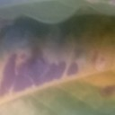 | 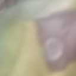 |  |  |

As imagens apresentadas acima correspondem apenas a uma amostragem visual das cinco classes utilizadas no projeto. O conjunto completo permanece organizado nos respectivos diretórios dentro de `data/`, seguindo o mesmo padrão de nomenclatura.

---

### 2.2 Pré-processamento das imagens

Antes do treinamento, as imagens deverão passar por uma etapa de preparação. Essa etapa terá como objetivo adequar os arquivos ao formato de entrada exigido pelo modelo e reduzir possíveis diferenças relacionadas à resolução, escala e iluminação.

O processamento poderá incluir redimensionamento das imagens, normalização dos valores dos pixels e aplicação de técnicas de aumento de dados (*\*data augmentation\**). Entre as possíveis transformações estão pequenas rotações, espelhamentos, alterações moderadas de brilho e variações de enquadramento.

Essa etapa é importante porque a aplicação final deverá receber imagens produzidas por smartphones em condições diferentes das imagens utilizadas durante o treinamento. Assim, aumentar a diversidade das amostras durante o treinamento pode contribuir para melhorar a capacidade de generalização do modelo.

### 2.3 Treinamento do modelo

O treinamento será realizado utilizando aprendizado supervisionado, uma vez que as imagens utilizadas possuem classes conhecidas. O modelo receberá como entrada uma imagem de folha e aprenderá a associar características visuais presentes na imagem à classe correspondente.

Uma possibilidade para o desenvolvimento é utilizar uma arquitetura de classificação baseada em redes neurais convolucionais, empregando **\*\*transfer learning\*\***. Nesse cenário, uma rede previamente treinada em grandes conjuntos de imagens pode ser adaptada para as cinco classes do problema.

Durante o treinamento, os dados serão divididos em subconjuntos de treinamento, validação e teste. O conjunto de treinamento será utilizado para ajustar os parâmetros da rede, enquanto o conjunto de validação permitirá acompanhar o comportamento do modelo durante o processo de aprendizagem. O conjunto de teste será reservado para a avaliação final.

Essa estratégia também é observada em trabalhos recentes que utilizam o conjunto de 58.555 imagens para classificação de doenças do cafeeiro. Um estudo recente, por exemplo, empregou divisão de 70% para treinamento, 15% para teste e 15% para validação.

Ao final do processo, serão obtidos os **pesos do modelo**, que representam os parâmetros aprendidos pela rede durante o treinamento. Esses pesos serão utilizados posteriormente pela aplicação para realizar inferências sobre novas imagens.

### 2.4 Classificação proposta

Inicialmente, a solução será desenvolvida considerando as cinco classes originais:

- **Healthy** → Saudável
- **Miner** → Minador
- **Rust** → Ferrugem
- **Phoma** → Phoma
- **Cercospora** → Cercosporiose

Essa abordagem permite que o sistema forneça uma resposta mais específica do que simplesmente indicar se uma folha está saudável ou doente.

Entretanto, uma segunda possibilidade de utilização consiste em agrupar as classes em duas categorias:

- **Saudável:** Healthy;
- **Doente:** Miner, Rust, Phoma e Cercospora.

Essa classificação binária poderá ser utilizada caso o objetivo principal seja desenvolver uma ferramenta de triagem inicial.

Essa possibilidade também é sustentada por trabalhos que utilizaram o mapeamento de **\*\*Healthy → Healthy\*\*** e das classes Miner, Cercospora, Rust e Phoma para **\*\*Unhealthy\*\***, demonstrando a possibilidade de utilizar o conjunto em uma tarefa binária.

---

## 3. Desenvolvimento da Progressive Web App

Após o treinamento, será desenvolvida uma **Progressive Web App (PWA)** para disponibilizar o modelo ao usuário final.

A escolha de uma PWA está relacionada à possibilidade de utilizar a mesma aplicação por meio de um navegador web e em dispositivos móveis, evitando a necessidade de desenvolver inicialmente aplicativos independentes para diferentes sistemas operacionais.

A aplicação será estruturada em três etapas principais:

**1. Captura da imagem → 2. Processamento → 3. Classificação**

O usuário poderá acessar a aplicação utilizando um navegador compatível. Em um smartphone, a interface poderá solicitar autorização para utilização da câmera. Após a autorização, uma imagem da folha será capturada diretamente pelo dispositivo.

A imagem será então preparada conforme os mesmos critérios utilizados durante o treinamento do modelo, como redimensionamento e normalização. Posteriormente, será encaminhada ao modelo de inteligência artificial para realização da inferência.

O resultado poderá ser apresentado ao usuário de maneira simples, por exemplo:

**Resultado:** Folha possivelmente saudável  
**Confiança do modelo:** 94%

ou, no modo multiclasse:

**Resultado:** Ferrugem  
**Confiança do modelo:** 91%

É importante destacar que o valor de confiança apresentado pela rede não deve ser interpretado automaticamente como uma confirmação agronômica ou diagnóstico definitivo. O sistema será concebido como uma ferramenta de **auxílio à identificação visual**, e não como substituto de avaliação realizada por profissional especializado.

---

## 4. Arquitetura proposta

A arquitetura geral do sistema poderá ser representada pelo seguinte fluxo:

```text

Base de imagens classificadas

            ↓

     Pré-processamento

            ↓

    Treinamento da rede

            ↓

     Geração dos pesos

            ↓

 Integração dos pesos na PWA

            ↓

          PWA

            ↓

 Câmera do smartphone/computador

            ↓

     Nova imagem da folha

            ↓

     Pré-processamento

            ↓

     Inferência do modelo

            ↓

        Classificação

```

Dessa forma, o treinamento e a aplicação final serão tratados como duas etapas relacionadas, porém distintas. O treinamento será realizado previamente, enquanto a PWA utilizará os pesos já aprendidos para classificar novas imagens.

Um dos principais benefícios dessa arquitetura é permitir que o usuário final não precise realizar o treinamento do modelo. Ele apenas acessará a aplicação e fornecerá uma imagem para análise.

---

## 5. Avaliação do modelo

A avaliação deverá considerar métricas apropriadas para problemas de classificação. Entre as métricas previstas estão **acurácia, precisão, revocação (recall), F1-score e matriz de confusão**.

A matriz de confusão será especialmente importante porque permitirá identificar quais classes apresentam maior dificuldade de diferenciação. Por exemplo, poderá ser observado se o modelo confunde determinadas folhas com ferrugem e cercosporiose ou se apresenta maior dificuldade na identificação de folhas saudáveis.

Além da avaliação realizada com as imagens de teste, será importante realizar uma segunda avaliação utilizando imagens capturadas diretamente por smartphones. Essa etapa é particularmente relevante para a proposta da PWA, pois as imagens utilizadas no ambiente real podem apresentar diferenças de iluminação, distância, orientação, fundo e qualidade em relação às imagens utilizadas no treinamento.

Assim, a avaliação final deverá considerar não somente o desempenho estatístico do modelo, mas também sua capacidade de funcionar em condições próximas àquelas encontradas pelo usuário.

---

## 6. Resultados esperados

Espera-se desenvolver um modelo capaz de classificar imagens de folhas de café nas cinco categorias presentes no conjunto utilizado, bem como disponibilizar esse modelo em uma aplicação acessível por navegador.

Como resultado tecnológico, espera-se obter uma PWA capaz de utilizar a câmera do dispositivo para capturar uma imagem e submetê-la ao modelo treinado. A aplicação deverá apresentar ao usuário a classe estimada pelo modelo e uma medida de confiança da previsão.

Outro resultado esperado é demonstrar a viabilidade da integração entre **inteligência artificial, visão computacional e tecnologias web** em uma aplicação direcionada ao contexto agrícola.

A utilização de imagens obtidas em condições reais constitui um aspecto relevante da proposta. O próprio conjunto JMuBEN/JMuBEN2 foi coletado em ambiente de plantação, incluindo imagens obtidas em diferentes condições de campo, e contou com a participação de especialista na identificação das condições foliares.

Entretanto, uma limitação importante é que o modelo será treinado com imagens provenientes de uma determinada origem geográfica e de um conjunto específico de condições de aquisição. Portanto, o desempenho em plantações de outras regiões, incluindo diferentes condições climáticas, variedades, iluminação e características das folhas, deverá ser avaliado experimentalmente.

---

## 7. Conclusão

Este trabalho propõe o desenvolvimento de uma solução baseada em inteligência artificial para classificação de folhas de café, utilizando imagens previamente classificadas e posteriormente disponibilizando o modelo treinado por meio de uma Progressive Web App.

O conjunto JMuBEN/JMuBEN2 apresenta características adequadas para essa finalidade, uma vez que reúne 58.555 imagens de folhas de café arábica distribuídas entre as classes Healthy, Miner, Rust, Phoma e Cercospora, com identificação das condições das folhas e das doenças.

A estratégia proposta consiste em utilizar essas imagens para treinamento de uma rede de classificação, obter os pesos aprendidos e incorporá-los a uma aplicação web capaz de utilizar a câmera de computadores e dispositivos móveis. Dessa maneira, pretende-se criar uma ferramenta simples para realizar uma primeira análise visual automatizada de folhas de café.

Como continuidade do trabalho, deverão ser realizados experimentos para avaliar o desempenho do modelo, comparar diferentes arquiteturas de redes neurais, analisar possíveis confusões entre classes e testar a aplicação com imagens capturadas diretamente por smartphones em condições reais. Dessa forma, será possível verificar não somente a capacidade de classificação do modelo em um conjunto controlado de teste, mas também sua aplicabilidade prática em um cenário agrícola.

---

## Referências

1. JEPKOECH, J.; MUGO, D. M.; KENDUIYWO, B. K.; TOO, E. C. **Arabica coffee leaf images dataset for coffee leaf disease detection and classification**. **Data in Brief**, v. 36, 107142, 2021. DOI: 10.1016/j.dib.2021.107142. https\://pmc.ncbi.nlm.nih.gov/articles/PMC8165403/

2. KROHLING, R.; TOZZI DE SOUZA, J. E.; TASSIS, L. M. **BRACOT – A Brazilian Arabica Coffee Tree images dataset for instance segmentation of coffee leaves**. Mendeley Data, 2021. DOI: 10.17632/pmkbyjpf6k.1. https\://data.mendeley.com/datasets/pmkbyjpf6k/1

3. **Arabica coffee leaf disease classification dataset – JMuBEN/JMuBEN2**. Mendeley Data, 2021. Conjunto de imagens classificadas de folhas de café arábica nas categorias Healthy, Miner, Rust, Phoma e Cercospora. https\://data.mendeley.com/datasets/t2r6rszp5c/1

---

# Resultados do PWA

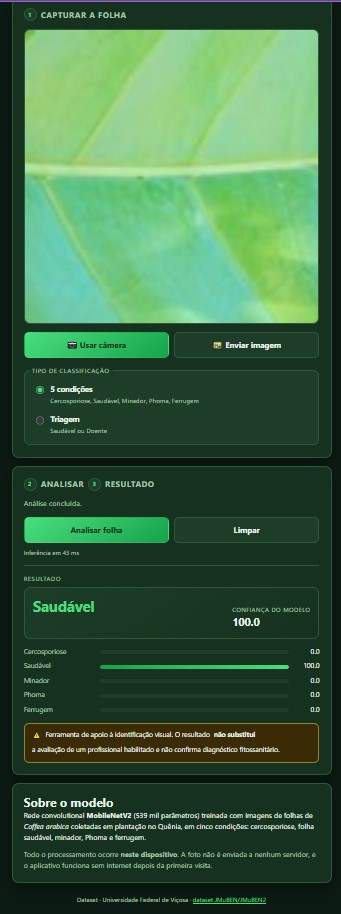